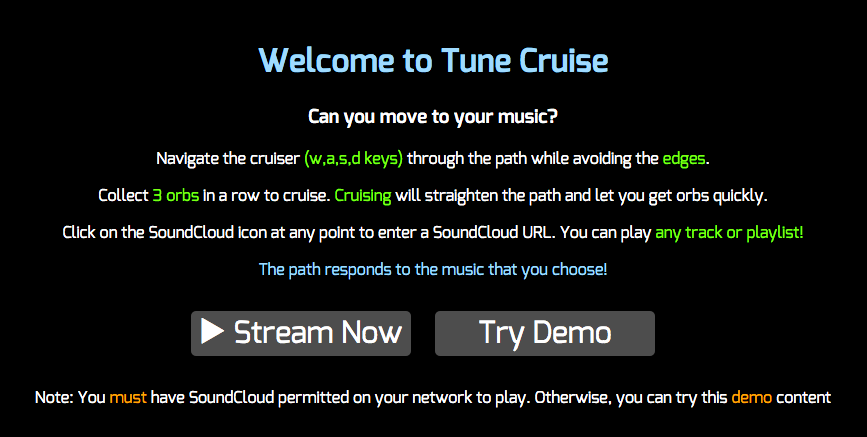
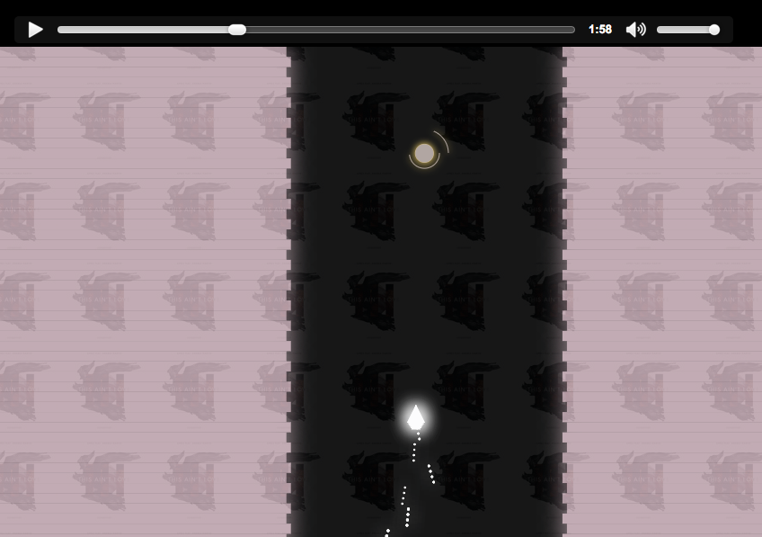

# Tune Cruise

[Tune Cruise Live Demo][heroku]
[heroku]: https://tune-cruise.herokuapp.com/

Tune Cruise is an interactive JavaScript game that visualizes music selected by the user. It utilizes SoundCloud's API to stream music, HTML5's audio API to analyze music files, Canvas, and JQuery for dynamic effects.



## Features & Implementation

### Dynamic Music Visualization



Tune Cruise renders all of its content based on the audio playing in the browser. HTML5's audio API offers clients the ability to generate an Audio object which when coupled with an AudioContext object can parse audio files and generate arrays representing the frequency and volume of the audio. Visual content is then based on the values of the arrays to render content that is responsive to the audio playing.

```JavaScript
//Basic setup to create the audio analyzer

var audio = new Audio();
var musicPlayer = new MP3Player(audio, score);
var context = new window.AudioContext();
var analyzer = context.createAnalyser();
var source = context.createMediaElementSource(audio);
source.connect(analyzer);
analyzer.connect(context.destination);

```

Because audio files are not static it is necessary to iterate over every frame that the audio file is playing to extract the data (called the frequencyByte array or fbcArray for short.)

```JavaScript
//Iterate framelooper at the browser's frame rate

var frameLooper = function() {
  window.requestAnimationFrame(frameLooper);
  var fbcArray = new window.Uint8Array(analyzer.frequencyBinCount);
  analyzer.getByteFrequencyData(fbcArray);
  // fbcArray now will be an array of sound data

```

Each entry in the array is a number between 0 and 255 representing the magnitude of a particular frequency. This maps nicely to rgb color values for visuals among other effects.

### Stream Music From SoundCloud For Unique In-Game Experience

Because the game plays based on any music passed to it, functionality was added to stream music over SoundCloud. The game makes API requests based on SoundCloud's "resolve" helper. This converts any URL of any SoundCloud page into the actual id of the track or playlist. SoundCloud can then fetch and return the file path of the music file.


## Future Directions for the Project

In addition to the features already implemented, I plan to continue work on this project to improve user experience and playability. The next steps for Tune Cruise are outlined below.

### Additional Visuals

The fbcArray provided through the audio API is very rich in data and I plan to further expand on the visual effects in the game. Current the game listens to strong bass and strong treble notes to change visuals but this could be expanded on for more customization.

### Leaderboards

Functionality could be included such that each song and playlist has a leaderboard enhancing the user experience. This could be implemented on top of SoundCloud's API which already generates objects for each track and playlist.
